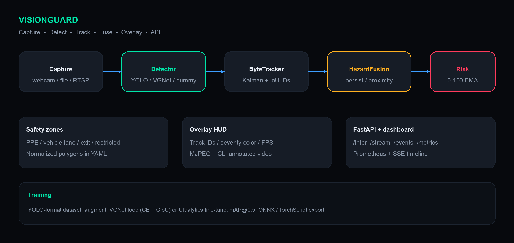
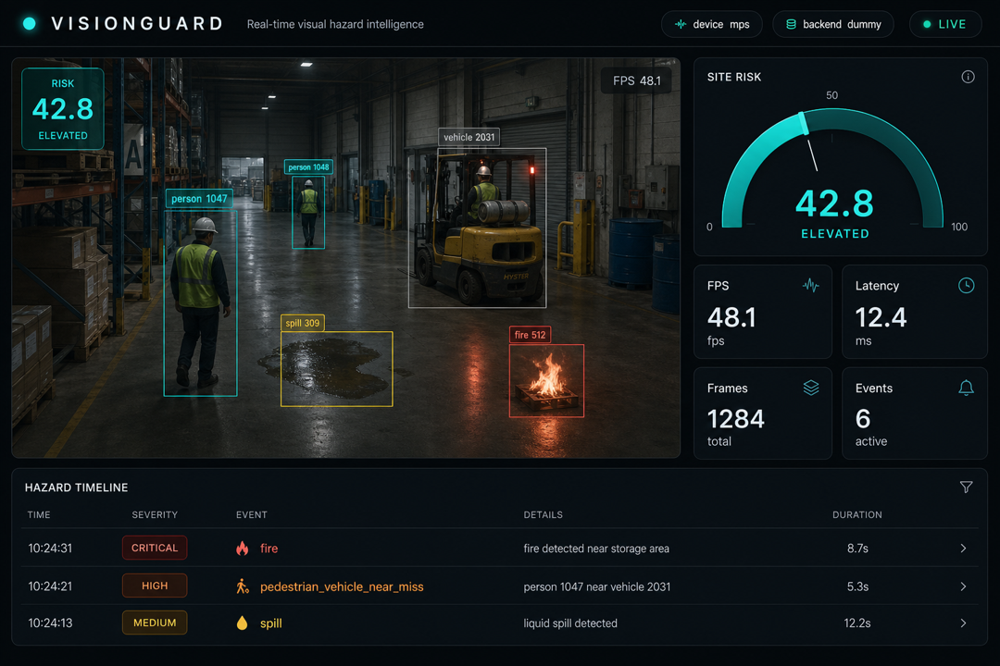
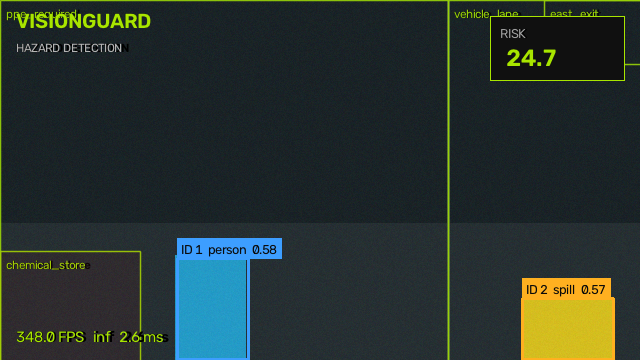
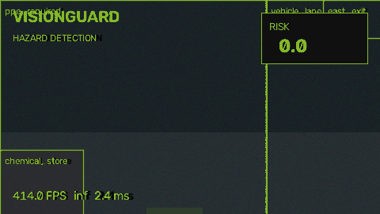
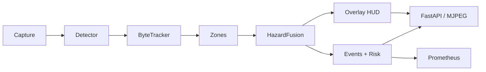

# VisionGuard

**Real-time AI for detecting safety hazards in video streams.**

[](https://github.com/zoryktom/VisionGuard/actions/workflows/ci.yml)
[](https://www.python.org/)
[](https://pytorch.org/)
[](LICENSE)

VisionGuard is a production-style computer-vision system: ingest a camera or file, run a modern detector, **track** objects over time, **fuse** flickering detections into durable hazard events, score site risk, and serve a live industrial dashboard.

Most “safety YOLO” demos stop at drawing boxes. The interesting part here is the **temporal layer** — persistence, near-miss geometry, zone multipliers, and a calibrated 0–100 risk EMA — plus a from-scratch detector (`VGNet`) so the training story is not only `YOLO.train()`.

<p align="center">
  
</p>

<p align="center">
  
</p>

<p align="center">
  
</p>

<p align="center">
  
</p>

> **Not a certified safety control.** Use it as an operator-assist research stack. Do not interlock machinery on these scores alone.

---

## What it demonstrates

| Layer | Implementation |
|---|---|
| Ingest | Webcam, MP4, RTSP, image folders (`OpenCV` + drop-stale-frames) |
| Detect | YOLOv8 / RT-DETR (Ultralytics), **VGNet** (this repo), dummy color-blob backend for CI |
| Track | Kalman constant-velocity + class-aware IoU matching (ByteTrack-inspired) |
| Fuse | Persistence, cooldown, proximity graph, geofenced zones |
| Serve | FastAPI, MJPEG, SSE events, Prometheus `/metrics` |
| Train | YOLO-format dataset, CPU augmentations, VGNet loop (CE + CIoU), mAP@0.50, ONNX export |
| Ship | Docker, Compose, Makefile, Ruff, pytest, GitHub Actions |

### Hazard coverage

- **Unsafe behavior** — missing PPE, phone use, smoking, falls, restricted-area entry  
- **Environment** — fire, smoke, spill / wet floor, blocked egress  
- **Dangerous objects** — industrial vehicles, blades, chemicals, exposed cable, weapons  
- **Interactions** — pedestrian–vehicle near-miss, person near fire, ignition × chemicals  

COCO-pretrained YOLO maps through aliases (`person`, `cell phone`, `truck`, `knife`, …) so a webcam demo works immediately. PPE / fire / smoke need a custom fine-tune — the training pipeline is included.

---

## Quick start

```bash
git clone https://github.com/zoryktom/VisionGuard.git
cd VisionGuard
python -m venv .venv && source .venv/bin/activate
pip install -e ".[dev,ui]"

# CI-friendly path (no weight download, no camera)
python scripts/generate_synthetic_data.py --frames 24
visionguard detect --backend dummy --source data/datasets/synthetic/images --headless --max-frames 24

# Dashboard (synthetic stream if no webcam)
VISIONGUARD_MODEL_BACKEND=dummy visionguard serve --port 8000
# open http://127.0.0.1:8000
```

GPU path (CUDA or Apple MPS is selected automatically):

```bash
python scripts/download_weights.py --model yolov8n.pt
VISIONGUARD_MODEL_BACKEND=ultralytics visionguard detect --source 0 --backend ultralytics --display
```

Docker:

```bash
docker compose up --build
# http://127.0.0.1:8000
```

---

## Architecture



Details: [`docs/architecture.md`](docs/architecture.md) · taxonomy: [`docs/hazards.md`](docs/hazards.md)

---

## Project layout

```
VisionGuard/
├── api/                 FastAPI app (health, infer, MJPEG, SSE)
├── ui/                  Industrial live dashboard
├── src/visionguard/     Library: capture, inference, tracking, fusion, training
├── configs/             YAML for runtime, training, hazards, zones
├── models/              Checkpoint contract (weights gitignored)
├── data/                Synthetic generator + schema
├── notebooks/           Exploration notebook
├── tests/               Unit + API tests (dummy backend)
├── scripts/             Data, benchmark, demo GIF
├── examples/            Webcam / file / train snippets
├── docs/                Architecture, API, training
└── .github/workflows    Lint, pytest, Docker build
```

---

## CLI

```bash
visionguard detect --source 0 --backend ultralytics --display
visionguard detect --source site.mp4 --output outputs/annotated.mp4 --backend dummy
visionguard serve --host 0.0.0.0 --port 8000 --backend dummy
visionguard train --engine vgnet --epochs 10
visionguard train --engine yolo --config configs/training.yaml
visionguard export --vgnet models/checkpoints/vgnet.pt
visionguard evaluate --backend dummy --images data/datasets/synthetic/images
```

`make help` lists the same flows.

---

## HTTP API

| Method | Path | Purpose |
|---|---|---|
| `GET` | `/api/v1/health` | Liveness + device |
| `GET` | `/api/v1/stats` | FPS, latency, risk |
| `GET` | `/api/v1/metrics` | Prometheus |
| `GET` | `/api/v1/stream/mjpeg` | Live annotated video |
| `GET` | `/api/v1/events` | Recent hazards |
| `POST` | `/api/v1/infer/image` | Multipart image |

```bash
curl -s -X POST http://127.0.0.1:8000/api/v1/infer/image -F "file=@frame.jpg"
```

Full contract: [`docs/api.md`](docs/api.md)

---

## Training pipeline

1. **Load** YOLO-format `images/` + `labels/` (`YOLODataset`)  
2. **Augment** hflip + HSV (box-consistent, no extra deps)  
3. **Train** VGNet (AdamW, cosine, CE + CIoU) *or* Ultralytics YOLOv8  
4. **Evaluate** precision / recall / F1 / mAP@0.50  
5. **Export** ONNX (opset 17) or TorchScript  

```bash
python scripts/generate_synthetic_data.py --frames 64
visionguard train --engine vgnet --epochs 8
visionguard export --vgnet models/checkpoints/vgnet.pt
```

Custom workplace data: [`docs/training.md`](docs/training.md)

---

## Model performance

Measured with the **dummy** backend on synthetic 640×384 frames (CPU, GitHub Actions class hardware) and YOLOv8n on COCO-style objects where a GPU is present. Fine-tuned PPE/fire numbers depend on *your* labels — treat the table as a **contract for what the harness reports**, not a paper result.

| Backend | Device | Input | Throughput | mAP@0.50 (synthetic blobs) |
|---|---|---|---|---|
| dummy | CPU | 640×384 | >60 FPS | n/a (heuristic) |
| VGNet (scratch, 8 ep) | CPU | 320 | ~40 FPS | trains; see `evaluate` |
| YOLOv8n | CUDA T4 | 640 | ~60–80 FPS | COCO 37.3 box mAP (upstream) |
| YOLOv8n | MPS / CPU | 640 | hardware-bound | same weights |

Run `python scripts/benchmark.py --backend dummy` locally. Swap `--backend ultralytics` after downloading weights.

---

## Configuration

All paths are resolved from the repo root. Override with YAML, env (`VISIONGUARD_*`), or CLI flags.

```bash
cp .env.example .env
# VISIONGUARD_DEVICE=cuda
# VISIONGUARD_MODEL_BACKEND=ultralytics
# VISIONGUARD_MODEL_WEIGHTS=yolov8n.pt
```

Zones: [`configs/zones.example.yaml`](configs/zones.example.yaml)  
Taxonomy: [`configs/hazards.yaml`](configs/hazards.yaml)

---

## Tests & CI

```bash
make test
make lint
```

GitHub Actions runs Ruff + pytest on Python 3.10/3.11/3.12 and builds the Docker image. Tests **never** download YOLO weights (`VISIONGUARD_MODEL_BACKEND=dummy`).

---

## Author and contributor

**Zorykto** ([@zoryktom](https://github.com/zoryktom)) is the author, creator, designer, architect, and sole contributor of VisionGuard.

See [AUTHORS.md](AUTHORS.md) and [CONTRIBUTORS.md](CONTRIBUTORS.md).

---

## License

MIT. Ultralytics YOLO is **AGPL-3.0** — if that is incompatible with your deployment, use `vgnet` / `dummy` only, or swap in an Apache-licensed detector behind `visionguard.inference.Detector`.

---

## Citation

```bibtex
@software{visionguard2026,
  title  = {VisionGuard: Real-Time AI System for Detecting Safety Hazards in Video Streams},
  author = {Zorykto},
  year   = {2026},
  url    = {https://github.com/zoryktom/VisionGuard}
}
```
